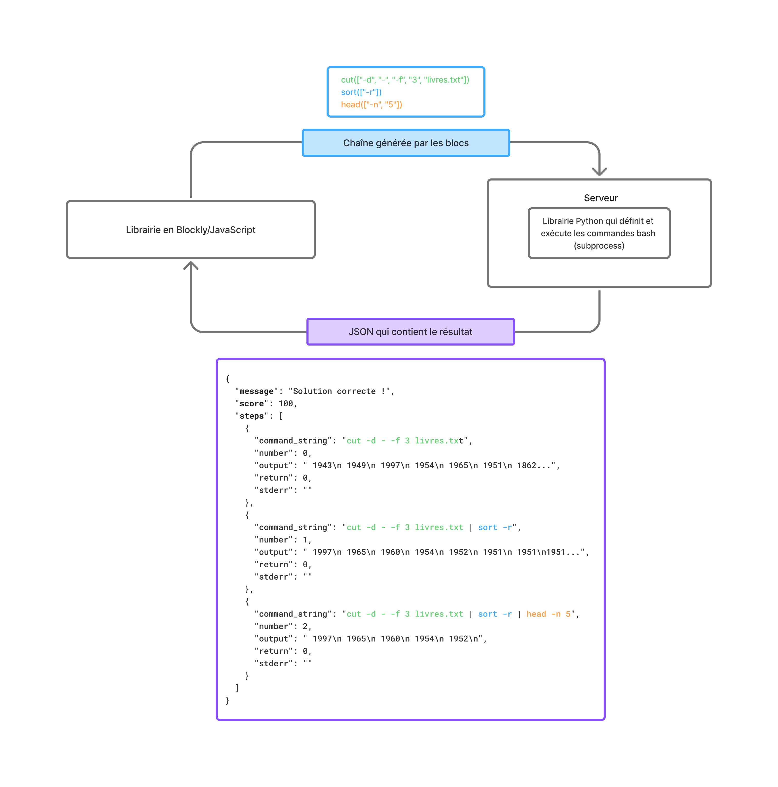

# Présentation
Ce projet a été réalisé pendant mon stage de troisième année de licence d'Informatique à l'Université de Lille. Il consiste à implémenter une interface de programmation par blocs permettant l'apprentissage des filtres Unix (grep, tr, cut,...).

- Le dépôt [unixfilters-franceIOI](https://github.com/UnixFilters/unixfilters-franceIOI) qui contient la librairie pour la définition des blocs en Blockly/JavaScript
  Il est composé de deux parties principales :
  - le front en JavaScript qui utilise la libriarie Blockly de Google : [/public](https://github.com/UnixFilters/unixfilters-franceIOI/tree/main/public)
  - le back qui permet l'exécution des commandes Bash en Python en utilisant le module subprocess : [/python_lib](https://github.com/UnixFilters/unixfilters-franceIOI/tree/main/python_lib)
- Le dépôt [checker](https://github.com/UnixFilters/checker) qui gère la logique d'exécution de la commande et son évaluation par rapport à une solution donnée.

En collaboration avec l'association France-IOI.

## Documentation
La documentation complète peut être trouvée [ici](https://unixfilters.github.io/unixfilters-docs/).
## Architecture


## Arborescence
### unixfilters

#### Interface Blockly/JavaScript

[Voir l'aide](./help/add_block.md)

```bash
.
├── blocklyUnixFilters_lib.js # Librairie contenant la définition des blocs
├── index.css # Style de la page html
├── index.html # Contenu de la tâche
├── jsongenerator.js # Génération du code pour chaque bloc
├── task.js # Contient les paramètres de la tâche (blocs disponibles, nombre de blocs autorisés,...)
└── unixfilters.js # Logique de l'affichage et de l'envoi de la commande au serveur
```

#### Librairie Python

[Voir l'aide](./help/add_command.md)

```bash
.
└── server.py # Reçoit le code généré par les blocs et utilise le checker pour renvoyer le résultat au front
```

### checker
```bash
.
├── blocklyUnixFilters_lib.js
├── docs
│ ├── documentation_checker.md
│ └── documentation_checker.py
├── exemple_checker
│ └── tests
│  ├── copie de la librairie blockly
│  │ └── ...
│  ├── files
│  │ ├── test01.in # Fichier pris en entrée par le checker
│  │ ├── test01.out # JSON obtenu après exécution du code
│  │ └── test01.solout # Résultat attendu
│  └── gen
│    ├── checker.py # Logique permettant d'évaluer le score et renvoyer le feedback
│    ├── commands.py # Librairie exécutant les commandes
│    ├── livres.txt # Exemple de fichier d'entrée
│    └── solution.py # Contient le code généré par les blocs
├── index.css
├── index.html
├── jsongenerator.js
├── task.js
└── unixfilters.js
```


### Documentation
* [Getting started](https://github.com/UnixFilters/unixfilters-franceIOI/blob/main/README.md)
* [Mise en place d'une tâche](https://github.com/UnixFilters/unixfilters-franceIOI/blob/main/docs/init_task.md)
* [Documentation fonctions](https://unixfilters.github.io/unixfilters-docs/)
* [Documentation checker](https://github.com/UnixFilters/checker/blob/main/docs/documentation_checker.md)


Une première version du projet a été réalisée à partir d’un projet open-source existant.
[En savoir plus]()
