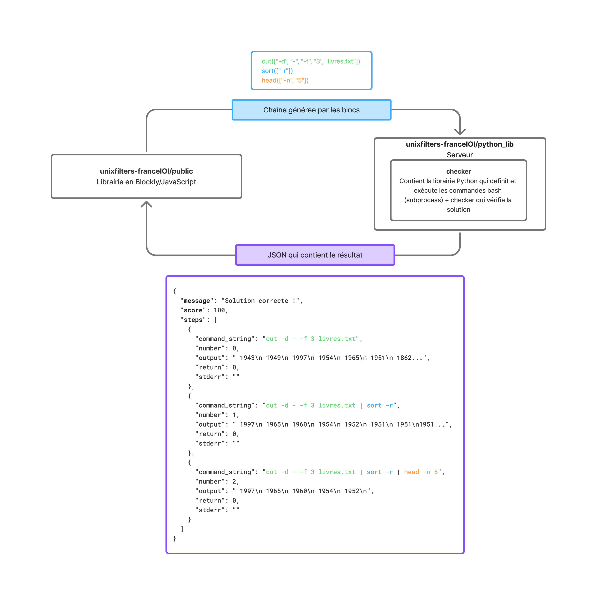

# Présentation
Ce projet a été réalisé pendant mon stage de troisième année de licence d'Informatique à l'Université de Lille. Il consiste à implémenter une interface de programmation par blocs permettant l'apprentissage des filtres Unix (grep, tr, cut,...).

Ce projet est en collaboration avec l'association France-IOI.

## Documentation
La documentation complète peut être trouvée [ici](https://unixfilters.github.io/unixfilters-docs/).
## Architecture

### Documentation
* [Getting started](https://github.com/UnixFilters/unixfilters-franceIOI/blob/main/README.md)
* [Mise en place d'une tâche](https://github.com/UnixFilters/unixfilters-franceIOI/blob/main/docs/init_task.md)
* [Documentation fonctions](https://unixfilters.github.io/unixfilters-docs/)
* [Documentation checker](https://github.com/UnixFilters/checker/blob/main/docs/documentation_checker.md)

Une première version du projet a été réalisée à partir d’un projet open-source existant.
[En savoir plus]()
